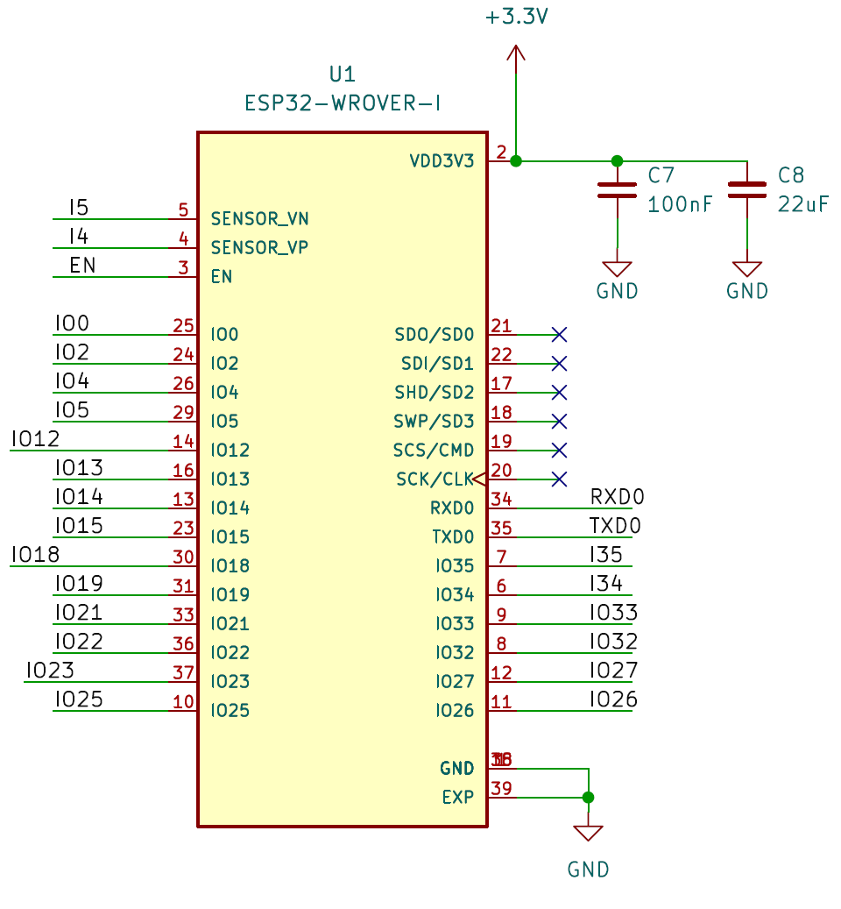
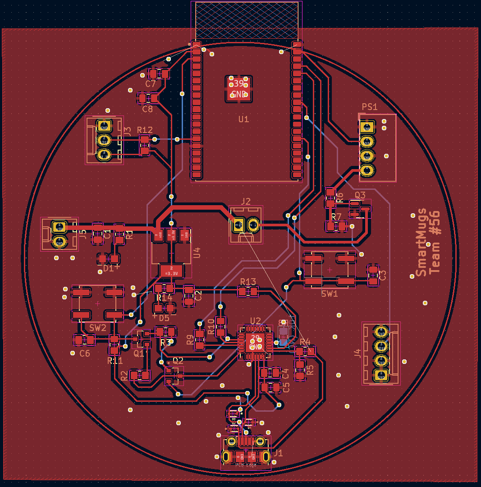

# Hani's Worklog

[[_TOC_]] 

# Week 2/6  
- Researched the power subsystem of commercially available products (the Ember Mug primarily).   
- 02/09/2023: Finalized Project Proposal.

# Week 2/13  
- Explored possible Qi Reciever Modules, ended up with the Adafruit universal Qi wireless charging [transmitter](https://www.adafruit.com/product/2162) and [receiver](https://www.adafruit.com/product/1901) modules to perform inductive charging of two Samsung 25R 18650 2500mAh 20A [Battery cells](https://www.18650batterystore.com/products/samsung-25r-18650?utm_campaign=859501437&utm_source=g_c&utm_medium=cpc&utm_content=201043132925&utm_term=_&adgroupid=43081474946&gclid=CjwKCAiA0JKfBhBIEiwAPhZXD4K0buQB4llCTCdtCz7RvFwBTh2EiDKCG829OV8GOinTmFSQxTqOxBoCbw0QAvD_BwE). These modules can be configured to track battery level and output a discharge cut-off voltage of 5V. 

# Week 2/20  
- Finalized desinged document

# Week 2/27  
- 02/28/2023: Design Review with Prof. Mironenko was conducted.
- The block diagram was modified to take into account the comments of Prof. Mironenko 

# Wee 3/6
- Actively developing the schematics of a NodeMCU Sheild to be connected to the PCB. Shelid footprint will be configured upon the successful completion of the PCB layout.   
- 03/08/2023: Selva & Jason proposed a single ESP32 SoC in lieu of the ESP8266 NodeMCU WiFi Serial Tranciever DevKit Board (rendering the previous design to be ineffective)
- 03/08/2023: Jason suggested the utilization of the TP4056-18650 Battery Management System as an intermediary layter between the Qi Reciever and the Li-ion Battey cells.  

# Week 3/20 
- Actively developing the schematics of the microcontroller subsystem with a [ESP32-WROVER-I](https://www.espressif.com/sites/default/files/documentation/esp32-wrover-e_esp32-wrover-ie_datasheet_en.pdf) MCU Module, [CP2102N-Axx-xQFN28](https://www.silabs.com/documents/public/data-sheets/cp2102n-datasheet.pdf) programmer, and mirco-usb port in a manner similar to the USB-to-UART serial conversion in the [ESSP32-C6 v4] (https://dl.espressif.com/dl/schematics/esp32_devkitc_v4-sch.pdf) Dvelopment kit. 
- The microcontroller expects 3.3-3.6V. To this end, I added the [AMS1117]([AMS1117](http://www.advanced-monolithic.com/pdf/ds1117.pdf)) LDO chip to regulate voltage to the desired voltage range.  
- Actively developing the power subsystem of our design to account for Jason's proposals. We have also added the TP4056-18650 battery management module to recharge the two battery cells and select the power supply output; the device is supplied with 5V form the USB bus if the USB port is connected. This addresses the contact bounce effects due to power spikes during external source power switching and reduces noise that cause battery exhaustion.
- The final power management subsystem will include a TP456-18650 Battey Mangement board connected to the Qi Reciever, the battery case, and an AMS1117 LDO voltage regulator.
- Siqi will handle the heating subsystem and would develop an automatic switching mechanism to adaptively control the temperature. 

# Week 3/27 
- The full device schametic is ready and a first PCB prototype is ready to be ordered.

